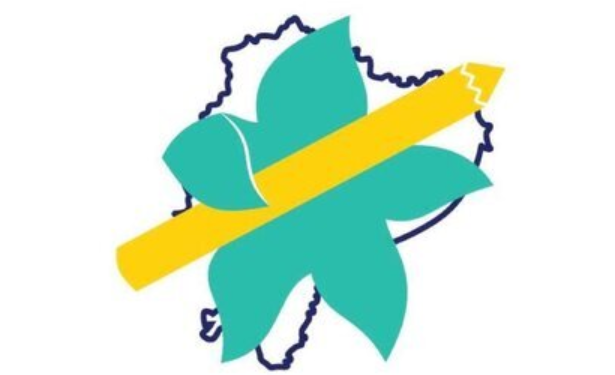

# Board of Directors Fundraising Analysis 
## The Starfish Foundation/ Fundación Estrellitas del Mar

This repository houses analysis of trends for past fundraising campaigns, for assistance with decision-making to the Board of Directors of the Starfish Foundation, Inc.  Starfish is a small international education NGO based in the US and Ecuador, with program implementation in Guayaquil, Ecuador. 

## About
The Starfish Foundation provides scholarship, tutoring, and leadership development to youth living in extreme poverty in Guayaquil, Ecuador. The Starfish Foundation believes in the importance of education as a catalyst for the future success of each student and their communities. The foundation provides scholarships and mentoring to students in financial need who have the drive to continue their studies, despite challenging circumstances.

### SCHOLARSHIP
The Starfish Foundation distributes scholarships in the form of all books, uniforms and materials required by the school. Students earn their scholarship based on participation in our tutoring program, motivation to study, and economic need. In order to remain in the scholarship program, all students attend monthly meetings, regularly present their grades, and participate in all other Starfish events and activities. 

### TUTORING
The tutoring program aims to empower the students to succeed in school, giving each student a safe space to complete their homework each day. All scholarship students participate in tutoring. Other students from the neighborhood also are invited to participate in tutoring to receive academic help and have the chance to earn a scholarship for the following year.

### LEADERSHIP DEVELOPMENT
All students, participate in community service and leadership development workshops. These activities include volunteering at local shelters, cleaning up the community, helping fellow students, and participating in and leading teamwork and leadership activities. 

